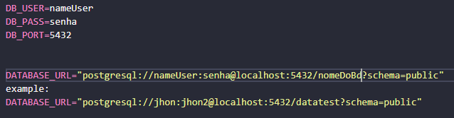
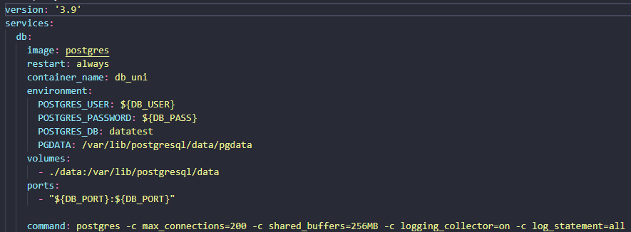
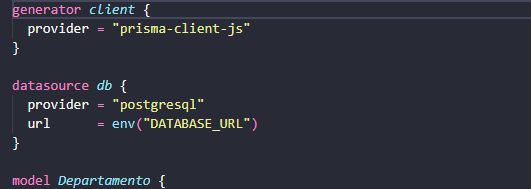
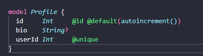
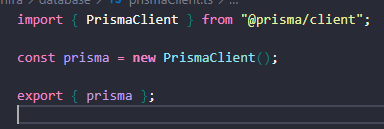
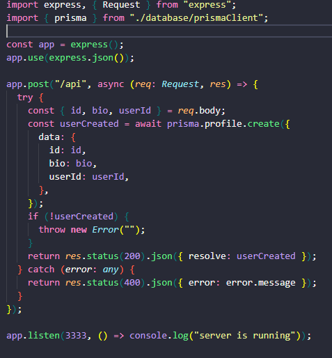

# Sistema universitário
# Como executar

**1: Clone o Repositório:**

git Clone

**2: Instale as dependências:**

npm install

**3: variaveis de ambiente:**

modifique a pasta .envExample para .env

modifique as váriavies se quiser

DATABASE_URL tem que está de acordo com o nomes de suas variaveis DB_USER, DB_PASS e DB_PORT

**4: Crie o container do banco de dados postgress**

docker-compose up

**5: Execute o container:**

docker-compose start

**6: Execute migrações do banco de dados**

npx prisma migrate dev

**7: Execute o projeto em modo de desenvolvimento**

npm run dev

# Criar um projeto Node, Typescript, Docker e Prisma
# Inicio

**1: Tenha o Node e o Docker instalados na máquina**

**2: Crie o package.json:**

npm init / npm init -y:  cria um arquivo package.json com alguns padrões customizados ou default.

**3: Instalar Express:**

npm install express

npm install @ypes/express -D:

# Ambiente de Desenvolvimento

**4: Instalar Typescript:**

npm install typescript -D:

**5: Gerar arquivo de configurção do Typescript:**

npm/npx tsc –init: 

tsconfig.json: alterar o outdir para o diretório /dist, desabilite o strict e resolvejsonmodule: true.

**6: Executar Projeto em desenvolvimento:**

npm install ts-node-dev -D:

crie o script no arquivo package.json

 dev : ts-node-dev --transpile-only --ignore-watch node_modules --respawn src/server.ts

 ### Formatação e padrões

 **7: Eslint e prettier**

npm install eslint --save-dev:

npx eslint --init: criar arquivo de configuração do eslint

npm install prettier eslint-plugin-prettier eslint-config-prettier --save-dev

# Banco de dados e Docker

**variaveis de ambiente**

npm install dotenv

crie o arquivo .env

configure suas variaveis que serão utilizadas para criar o container e para a conexão com o banco de dados

### Docker

**8: Crie o arquivo docker-compose.yml**

**9: Confugure seu container do BD postgress:**

Importante: Variaveis de ambiente influenciam na criação do container

**10: Criar container:**

docker-compose up: criar o container

docker-compose down: excluir container

**11: Execute o container criado:**

docker-compose start: executar o container do banco de dados

docker-compose stop: parar execução do container 

### Prisma

**12: Instalar prisma em desenvolvimento:**

npm install prisma –save-dev

**13: Inicializar o prisma:**

npx prisma init: cria um novo diretório chamado prisma que contém um arquivo chamado schema.prisma, que contém o esquema Prisma com sua variável de conexão de banco de dados e modelos de esquema. 

cria o .env arquivo no diretório raiz do projeto, que é usado para definir variáveis ​​de ambiente (como sua conexão com o banco de dados)

**14: Crie a estrutura do seu banco no arquivo schema.primsa**

**15: Faça migrações depois de alterações no seu schema**

npx prisma migrate dev

**15: Crie uma instancia do prisma cliente**

Pode ser criado dentro de um diretorio database e arquivo prismaCliente.ts

# Crie o servidor

**16: Crie a pasta src e o arquivo server.ts**

**17: crie suas rotas e utilize o banco de dados**

**17: execute o servidor em modo de desenvolvimento**

npm run dev

 

